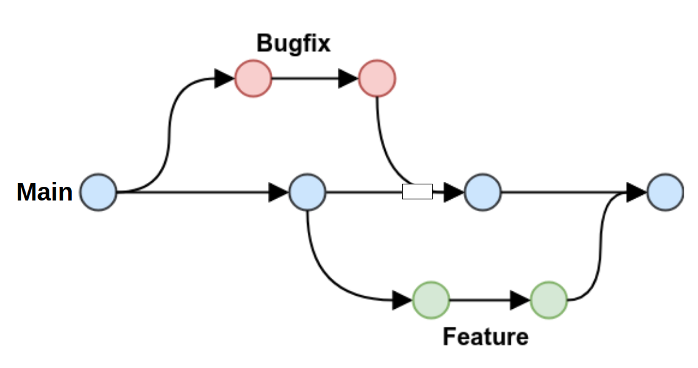

# Padrão de Commits Git

Os commits seguem o padrão **[Conventional Commits](https://www.conventionalcommits.org)**,
com pequenas extensões documentadas abaixo.

Formato: `tipo(escopo opcional): descrição curta no imperativo`

| Tipo | Finalidade | Exemplo |
| --- | --- | --- |
| `feat` | Criação de um novo componente ou recurso no código | `feat: criado histograma de número de vendas` |
| `fix` | Correção de um bug identificado | `fix: integração do Streamlit com plotly_express` |
| `docs` | Criação ou atualização de documentação (README, referências, comentários) | `docs: adicionado dicionário de dados em references/` |
| `refactor` | Reestruturação do código sem alterar comportamento externo | `refactor: funções de limpeza separadas em módulo próprio` |
| `style` | Alterações de formatação que não afetam o significado do código (espaços, ponto e vírgula, indentação) | `style: padronização de indentação no app_init.py` |
| `test` | Adição ou atualização de testes | `test: testes unitários para build_features.py` |
| `chore` | Tarefas de manutenção sem impacto direto no código de produção: remoção de arquivos, atualização de dependências, ajustes de configuração | `chore: removido notebook descartado da raiz` |
| `perf` | Alteração que melhora a performance | `perf: substituído loop por operação vetorizada no pandas` |

---

## Convenção para commits com documentação associada

Quando um commit cria código **e** documentação juntos, use o escopo `docs`:

```text
feat(docs): pipeline de clusterização com docstring explicativa
```

---

## Git Flow

Fluxo simplificado com três tipos de branch:

1. **`main`** — branch principal, estável. Representa o estado de homologação e produção.
   - Permanente.

2. **`feature/<nome>`** — desenvolvimento de novas funcionalidades.
   - Criada a partir da `main`.
   - Após conclusão: merge na `main` e branch deletada.
   - Exemplos: `feature/clusterizacao-kmeans`, `feature/eda-exploratoria`

3. **`bugfix/<nome>`** — correção de problema que exige isolamento antes de ser resolvido.
   - Criada a partir da `main`.
   - Após conclusão: merge na `main` e branch deletada.
   - Exemplos: `bugfix/erro-silhouette-score`

---


